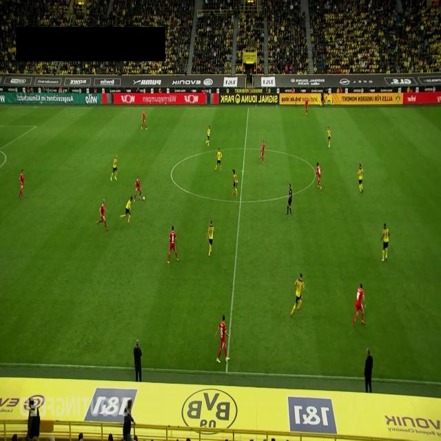
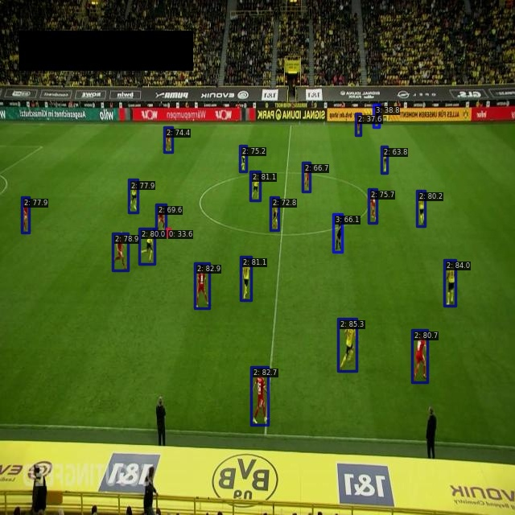

# Soccer Player Detection with Deep Learning

Demo for testing mmdetection and YOLO v8 in the roboflow "Soccer Player Detection Computer Vision Project" tutorial dataset.

## Dataset

The dataset is available at [Roboflow](https://universe.roboflow.com/prestona/soccer-player-detection-pk7eg). The data consists in images containing screenshots of soccer games streaming. The classes are the soccer players, goal keepers, referee/staff and the ball. The dataset was splitted in 429 training images, 124 validation images and 62 test images.

## Models

Models evaluated: YOLO v8, RTMDet, TOOD and ATSS.

## Results

| Model    | Set | Epochs | MAP-50 |
|----------|-----|--------|--------|
| RTMDet   | Val |   300  | 0.785  |
| YOLO v8  | Val |   300  | 0.962  |
| TOOD-r50 | Val |   300  | 0.690  |
| TOOD-r101| Val |   300  | 0.706  |
| ATSS-r50 | Val |   300  | 0.612  |
| ATSS-r101| Val |   300  | 0.659  |

### Visual results

- Original image:

- RTMDet inference

 